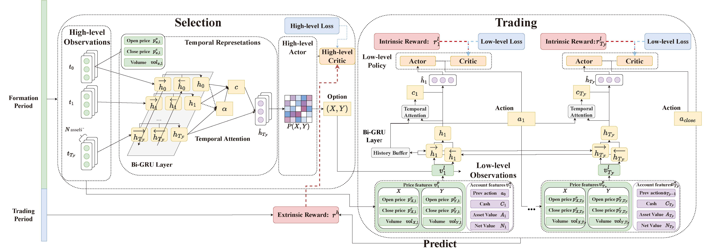

# Trials

[](https://github.com/chancefocus/trials/blob/main/README.zh.md)
[](https://github.com/chancefocus/trials/blob/main/README.md)
[](https://github.com/pre-commit/pre-commit)
[](https://pytorch.org/get-started/locally/)
[](https://black.readthedocs.io/en/stable/)
[](https://github.com/pre-commit/pre-commit)
[](https://python-poetry.org)
[](https://github.com/lazaratan/dyn-gfn/blob/main/LICENSE)

Automatic Pair Trading




## Description
Our codebase trials provide an implementation of the [Select and Trade](https://arxiv.org/abs/2301.10724) paper, which proposes a new paradigm for pair trading using hierarchical reinforcement learning. It includes the code for the proposed method and experimental results on real-world stock data to demonstrate its effectiveness.

## Maintainer
[Boyi Zhang](https://github.com/zbgzbgzbg)


## Prerequisite

The requirements to develop the project.

- Python ^3.8
- Git
- Poetry
- Python IDE (Visual Studio Code is recommended!)

**⚠️ Read the official manual or documentation of following projects before write any code ⚠️**:

- `git`, a version control system
- `Poetry`, a python library to manage project dependencies
- `towncrier`, a changelog generater
- `pre-commit`, a git commit hook runner
- `commitizen`, a semantic version manager

## Data Preparation

1. Download the symbols of target stocks and put the .csv file containing the symbols of the target stocks into selected_symbol_path； Download the processed data put all .csv files containing stock datas into stock_path

2. You can download the data of US stocks from the following website：[Tiingo stock marke](https://api.tiingo.com/documentation/iex)

3. Select and process eligible U.S.S&P 500 stocks by running(The processing steps of the Chinese stock dataset are the same as the following):

```bash
python trials/preprocess/U.S.SP500-selected.py selected_symbol_path stock_path store_path begin_time end_time

```

- `selected_symbol_path`, Stock symbols to be selected are stored in selected_symbol_path
- `stock_path`, All stocks are stored in stock_path
- `store_path`,  Eligible U.S.S&P 500 stocks that have been screened and processed are stored in store_path
- `begin_time`, The start time of the stocks to be screened. For example: '2000-01-01'
- `end_time`, The end time of the stocks to be screened. For example: '2020-12-31'

4. Randomly screen stocks from all stocks to form .csv of symbols, and generate as many .csv as possible with disjoint symbols. Then rolling.py can use these .csv to generate rolling datasets

```bash
python trials/preprocess/random_stocks_selected.py symbols_num_each_rolling, stock_data_path, random_symbol_path

```

- `symbols_num_each_rolling`, The number of stocks contained in each rolling
- `stock_data_path`, All U.S.S&P 500 stocks data screened by U.S.SP500-selected.py are stored in stock_data_path
- `random_symbol_path`, The stocks symbols in each rolling are stored in random_symbol_path

5. Form datasets for each period of each rolling in the form of .csv. by running:

```bash
python trials/preprocess/rolling.py stock_data_path store_path training_month validation_month testing_month random_symbol_path csv_name1 csv_name2 csv_name3

```

- `stock_data_path`, All U.S.S&P 500 stocks data screened by U.S.SP500-selected.py are stored in stock_data_path
- `store_path`, The final .csv files are stored in store_path
- `training_month`, The number of months included in the training
- `validation_month`, The number of months included in the validation
- `testing_month`,The number of months included in the testing
- `random_symbol_path`, The stock symbols included in each rolling that are randomly generated by random_stocks_selected.py in advance are stored in random_symbol_path

6. We provide a subset of the processed dataset, please check it in /trials/data/.


## How to Run?

1. Single Run

```bash
poetry run trials/scripts/train_trials.py
```

See all parameters and their illustrations by `poetry run trials/scripts/train_trials.py --help`

2. Hyperparameter Search
   We recommend to use hyperparamete search by wandb sweep.

Start with a template `sweep.yaml` to define searching parameters and values, then simply run:

```bash
wandb sweep rl_sweep.yaml
```

After showing

```bash
wandb: Run sweep agent with: wandb agent xxx/xxxxxxx/[sweep-id]
```

start the agents with `sweep-id`:

```bash
wandb agent xxx/xxxxxxx/[sweep-id]
```

Or you can start multiple agents with the script:

```bash
bash train_trials.sh [sweep-id] [num-process-per-gpu]
```


## License

[MIT](https://choosealicense.com/licenses/mit/)

## Feel free to cite our paper
```
@misc{han2023select,
      title={Select and Trade: Towards Unified Pair Trading with Hierarchical Reinforcement Learning}, 
      author={Weiguang Han and Boyi Zhang and Qianqian Xie and Min Peng and Yanzhao Lai and Jimin Huang},
      year={2023},
      eprint={2301.10724},
      archivePrefix={arXiv},
      primaryClass={q-fin.CP}
}
```
## Main Results

S&P 500:
|          |          | GGR      | Cointegration | Correlation | Wang     | TRIALS    | TRIALS wo TR |
|----------|------------|----------|---------------|-------------|----------|-----------|--------------|
| Subset 1 | SR↑        | -0.390   | -1.557        | -1.263      | 1.323    | **1.573** | -0.075       |
|          | ED↓        | **0.008** | 0.036         | 0.010       | 0.036    | 0.027     | 0.011        |
|          | MDD↑       | -0.146   | -0.407        | -0.227      | -0.111   | -**0.093** | -0.325       |
|          | AR↑        | -0.031   | -0.392        | -0.141      | 0.320    | **0.512** | -0.039       |
|          | AV↓        | **0.118** | 0.303         | 0.130       | 0.210    | 0.272     | 0.284        |
|          | Asset Pair | PG-TGT   | SPG_SWKS      | LMT-UNH     | SPG-SWKS | RTX-WY    | ED-WY        |
| Subset 2 | SR↑        | -2.005   | -1.836        | -1.576      | 0.735    | **2.099** | -0.078       |
|          | ED↓        | 0.015    | 0.008         | **0.006**   | 0.008    | 0.037     | 0.010        |
|          | MDD↑       | -0.334   | -0.249        | -0.223      | -**0.085** | -0.112    | -0.212       |
|          | AR↑        | -0.290   | -0.201        | -0.189      | 0.139    | **0.641** | -0.012       |
|          | AV↓        | 0.174    | **0.129**     | 0.140       | 0.167    | 0.240     | 0.192        |
|          | Asset Pair | AMGN-JPM | BLK-FMC       | NEE-ROP     | BLK-FMC  | ALB-EQR   | AMGN-MS      |
| Subset 3 | SR↑        | -1.492   | -1.739        | -1.297      | 1.700    | **1.862** | 0.021        |
|          | ED↓        | 0.022    | 0.044         | **0.005**   | 0.005    | 0.029     | 0.008        |
|          | MDD↑       | -0.245   | -0.739        | -0.127      | -0.103   | **-0.080** | -0.202       |
|          | AR↑        | -0.203   | -0.736        | -0.096      | **0.362** | 0.344     | 0.005        |
|          | AV↓        | 0.158    | 0.650         | **0.091**   | 0.179    | 0.153     | 0.203        |
|          | Asset Pair | KO-UPS   | CCL-PLD       | ADBE-MSFT   | CCL-PLD  | CCL-SCHW  | AES-PEAK     |
| Subset 4 | SR↑        | -0.552   | -1.665        | -1.160      | 1.511    | **2.102** | 0.153        |
|          | ED↓        | 0.016    | 0.006         | **0.006**   | 0.006    | 0.060     | 0.020        |
|          | MDD↑       | -0.096   | -0.196        | -0.164      | **0** | -0.100    | -0.331       |
|          | AR↑        | -0.061   | -0.181        | -0.087      | 0.104    | **0.666** | 0.029        |
|          | AV↓        | 0.136    | 0.128         | 0.093       | **0.050** | 0.247     | 0.244        |
|          | Asset Pair | A-CSCO   | ADM-GS        | HD-LOW      | ADM-GS   | INTC-NVDA | ADM-FCX      |
| Subset 5 | SR↑        | -2.418   | -2.346        | -1.737      | 0.611    | **1.564** | 0.349        |
|          | ED↓        | 0.010    | 0.009         | 0.007       | **0.007** | 0.033     | 0.009        |
|          | MDD↑       | -0.188   | -0.267        | -0.245      | -0.136   | **-0.089** | -0.176       |
|          | AR↑        | -0.162   | -0.267        | -0.199      | 0.128    | **0.336** | 0.072        |
|          | AV↓        | **0.080** | 0.137         | 0.135       | 0.193    | 0.182     | 0.187        |
|          | Asset Pair | VZ-WMT   | FAST-HUM      | AON-HON     | FAST-HUM | AMZN-VZ   | FAST-TER     |
| Mean     | SR↑        | -1.371   | -1.829        | -1.406      | 1.176    | **1.840** | 0.074        |
|          | ED↓        | 0.014    | 0.021         | **0.007**   | 0.021    | 0.037     | 0.011        |
|          | MDD↑       | -0.202   | -0.372        | -0.198      | **-0.087** | -0.095    | -0.249       |
|          | AR↑        | -0.149   | -0.355        | -0.142      | 0.210    | **0.500** | 0.011        |
|          | AV↓        | 0.133    | 0.269         | **0.118**   | 0.160    | 0.219     | 0.222        |
| STD      | SR↓        | 0.793    | 0.274         | 0.215       | 0.430    | 0.238     | **0.161**    |
|          | ED↓        | 0.005    | 0.016         | **0.002**   | 0.016    | 0.012     | 0.004        |
|          | MDD↓       | 0.082    | 0.197         | 0.045       | 0.047    | **0.011** | 0.065        |
|          | AR↓        | 0.095    | 0.204         | 0.046       | 0.108    | 0.141     | **0.038**    |
|          | AV↓        | 0.033    | 0.202         | **0.021**   | 0.057    | 0.044     | 0.037        |

CSI 300:
|          |            | GGR           | Cointegration | Correlation   | Wang          | TRIALS        | TRIALS wo TR  |
| -------- | ---------- | ------------- | ------------- | ------------- | ------------- | ------------- | ------------- |
| Subset 1 | SR↑        | 0.021         | -2.259        | -1.000        | 0.110         | **1.558**     | 1.491         |
|          | ED↓        | 0.007         | **0.007**     | 0.011         | 0.007         | 0.020         | 0.014         |
|          | MDD↑       | -0.309        | -0.316        | -0.161        | -0.164        | -0.057        | **-0.037**    |
|          | AR↑        | 0.004         | -0.326        | -0.094        | 0.024         | **0.269**     | 0.149         |
|          | AV↓        | **0.210**     | 0.177         | 0.114         | 0.192         | 0.146         | 0.081         |
|          | Asset Pair | 600653-600744 | 600808-822    | 568-858       | 600808-822    | 503-623       | 29-600740     |
| Subset 2 | SR↑        | -1.368        | -1.659        | -1.609        | 0.104         | **1.210**     | 0.910         |
|          | ED↓        | 0.016         | **0.007**     | 0.031         | 0.007         | 0.032         | 0.009         |
|          | MDD↑       | -0.323        | -0.304        | -0.238        | **-0.093**    | -0.162        | -0.153        |
|          | AR↑        | -0.221        | -0.250        | -0.196        | 0.025         | **0.375**     | 0.179         |
|          | AV↓        | 0.185         | 0.177         | **0.143**     | 0.171         | 0.277         | 0.174         |
|          | Asset Pair | 600091-600839 | 600103-600871 | 31-667        | 600103-600871 | 600109-600886 | 600219-600655 |
| Subset 3 | SR↑        | -1.763        | -0.728        | -1.222        | 0.802         | **1.352**     | -0.154        |
|          | ED↓        | **0.007**     | 0.018         | 0.009         | 0.018         | 0.054         | 0.015         |
|          | MDD↑       | -0.178        | **-0.173**    | -0.257        | -0.158        | -0.257        | -0.202        |
|          | AR↑        | -0.178        | -0.129        | -0.196        | 0.208         | **0.625**     | -0.027        |
|          | AV↓        | **0.119**     | 0.193         | 0.182         | 0.247         | 0.404         | 0.195         |
|          | Asset Pair | 600642-89     | 607-959       | 600690-600887 | 607-959       | 24-636        | 600633-600726 |
| Subset 4 | SR↑        | -2.041        | -2.741        | -1.368        | 0.774         | **3.614**     | 2.288         |
|          | ED↓        | **0.013**     | 0.028         | 0.014         | 0.028         | 0.078         | 0.033         |
|          | MDD↑       | -0.324        | -0.515        | -0.361        | -0.365        | -0.091        | **0.000**     |
|          | AR↑        | -0.321        | -0.525        | -0.295        | 0.278         | **1.676**     | 0.315         |
|          | AV↓        | 0.191         | 0.266         | 0.248         | 0.383         | 0.278         | **0.113**     |
|          | Asset Pair | 571-600190    | 518-600221    | 600741-786    | 518-600221    | 600809-825    | 400-939       |
| Subset 5 | SR↑        | -0.793        | -0.099        | -1.661        | **1.962**     | 1.798         | 0.213         |
|          | ED↓        | 0.024         | 0.024         | **0.011**     | 0.024         | 0.048         | 0.024         |
|          | MDD↑       | -0.326        | -0.135        | -0.252        | -0.130        | **-0.129**    | -0.221        |
|          | AR↑        | -0.159        | -0.011        | -0.258        | **0.649**     | 0.442         | 0.042         |
|          | AV↓        | 0.216         | **0.176**     | 0.183         | 0.261         | 0.203         | 0.297         |
|          | Asset Pair | 600215-921    | 600006-600115 | 46-600639     | 600006-600115 | 559-600074    | 553-600621    |
| Mean     | SR↑        | -1.189        | -1.497        | -1.372        | 0.750         | **1.906**     | 0.950         |
|          | ED↓        | **0.013**     | 0.017         | 0.015         | 0.017         | 0.046         | 0.019         |
|          | MDD↑       | -0.292        | -0.289        | -0.254        | -0.182        | -0.139        | -**0.122**    |
|          | AR↑        | -0.175        | -0.248        | -0.208        | 0.237         | **0.677**     | 0.132         |
|          | AV↓        | 0.184         | 0.198         | 0.174         | 0.251         | 0.261         | **0.172**     |
| STD      | SR↓        | 0.736         | 0.969         | **0.245**     | 0.678         | 0.877         | 0.877         |
|          | ED↓        | **0.006**     | 0.008         | 0.008         | 0.008         | 0.020         | 0.009         |
|          | MDD↓       | **0.057**     | 0.133         | 0.064         | 0.095         | 0.069         | 0.089         |
|          | AR↓        | **0.106**     | 0.175         | 0.068         | 0.229         | 0.513         | 0.118         |
|          | AV↓        | **0.035**     | 0.035         | 0.045         | 0.074         | 0.087         | 0.075         |

